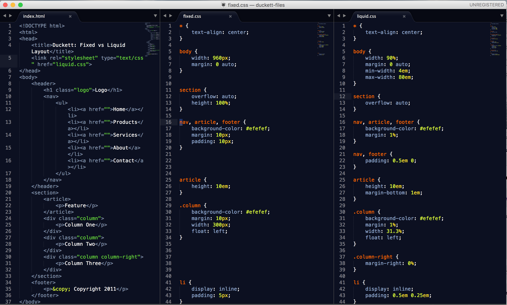
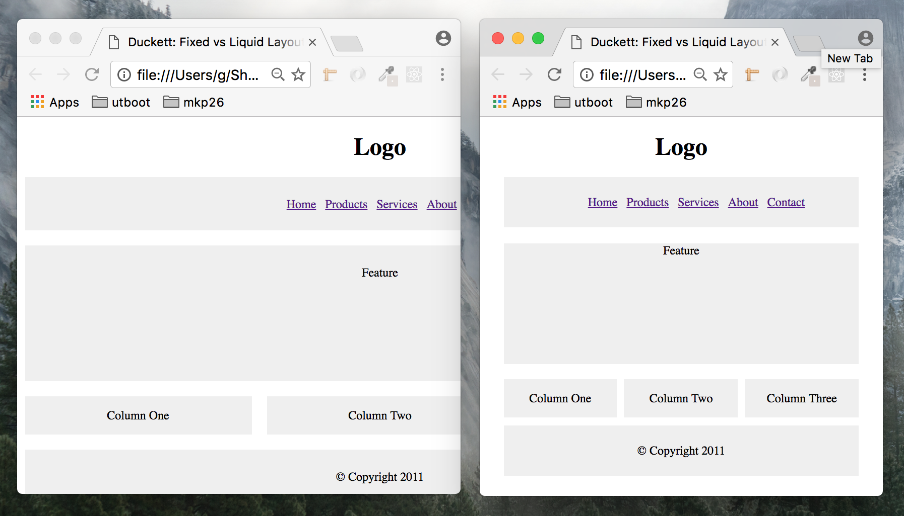

# Fixed Layout versus Liquid Layout

This is derived from Jon Duckett's execellent HTML & CSS Book

The next goal is to take the liquid concepts from Duckett and munge them with the more BEM-style css of Philip Walton.

