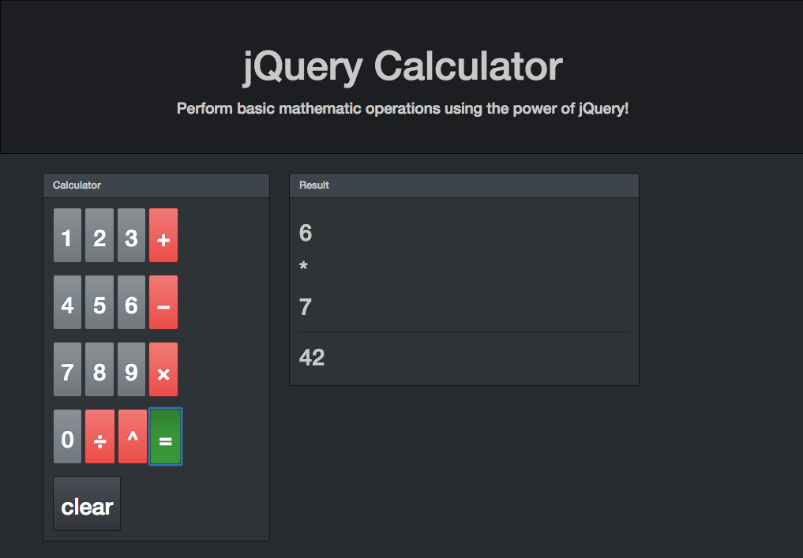

# Class Activity: jQuery Calculator

## Description

Implement a 5 function calculator using jQuery and a starter file that provides the visual layout.

## User Interface



## Design

The calculator is implemented under a Model View Controller (MVC)
pattern depicted below.

```javascript
                                                             [ keyboard ]
                                                                  |
                                                                  | triggers
    Model              View                          Controller   v
+-------------+  +----------------+         +-----------------------------------+
| calc object |  | calc user i/f  | updates | $(document).ready(calcController) |
|             |  | browser window |    +----|                                   |
+-------------+  +----------------+    |    +-----------------------------------+
   calc.js  ^        index.html        |                 controller.js
            | updates                  |             
            +--------------------------+
```
